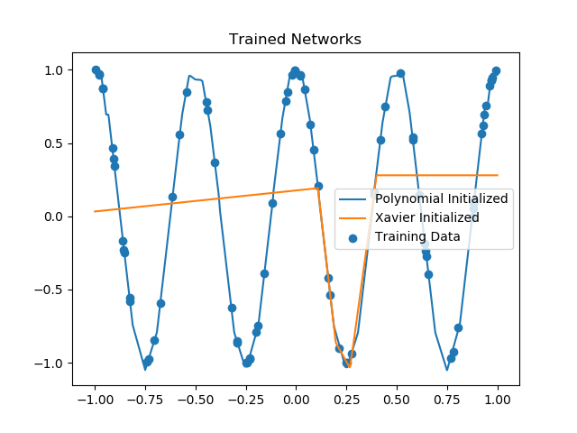

# poly-init-nets
Contains classes for various network architectures which can be initialized to behave like polynomials.
These classes are associated with a network described in this arxiv preprint:
https://arxiv.org/abs/1905.10457

## DeepNet Class
This class is contained in the file deep.py. 

It can be used for function approximation in $d$-dimensions. The network has (8d - 4) nodes per layer
and has L layers (L and d are parameters of the network). It can be initialied so that it behaves like 
a certain d-dimensional polynomial whose terms are of degree no larger than 4. It can also be initialized using
Xavier initialization.

For example, one can approximate a 1-d osciallting function. 
Here we plot the initialization of a network for approximating a 1-d function using
our polynomial initialization and Xavier inititialization.

After training these networks have the following behavior. The blue points 
are the sample values of the target function used for training the network.

Clearly, the polynomial initialized network was better able to learn the behavior 
of the target function.

## Extensions
Check back soon for extensions of these initialization techniques and the inclusion of 
more examples.

## MIT License
THE SOFTWARE IS PROVIDED "AS IS", WITHOUT WARRANTY OF ANY KIND, EXPRESS OR IMPLIED, INCLUDING BUT NOT LIMITED TO THE 
WARRANTIES OF MERCHANTABILITY, FITNESS FOR A PARTICULAR PURPOSE AND NONINFRINGEMENT. 
IN NO EVENT SHALL THE AUTHORS OR COPYRIGHT HOLDERS BE LIABLE FOR ANY CLAIM, DAMAGES OR OTHER LIABILITY, 
WHETHER IN AN ACTION OF CONTRACT, TORT OR OTHERWISE, ARISING FROM, OUT OF OR IN CONNECTION WITH THE 
SOFTWARE OR THE USE OR OTHER DEALINGS IN THE SOFTWARE.
